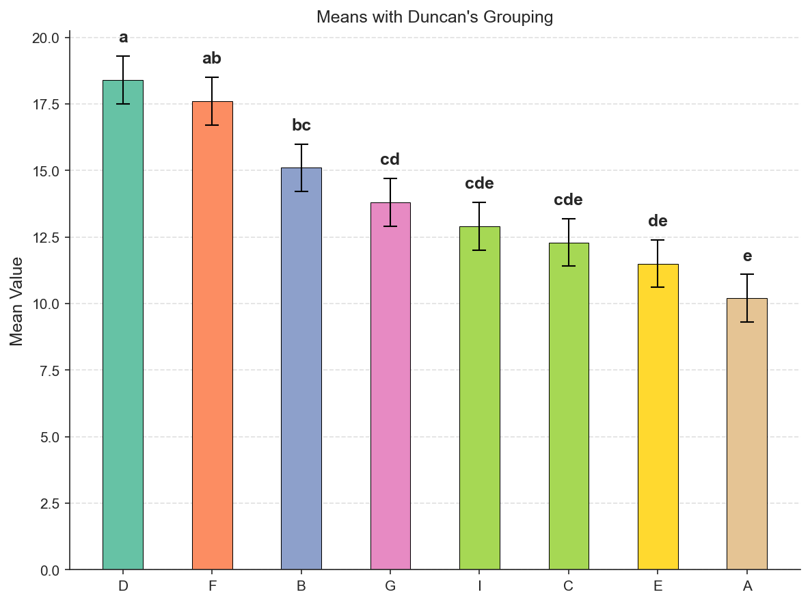
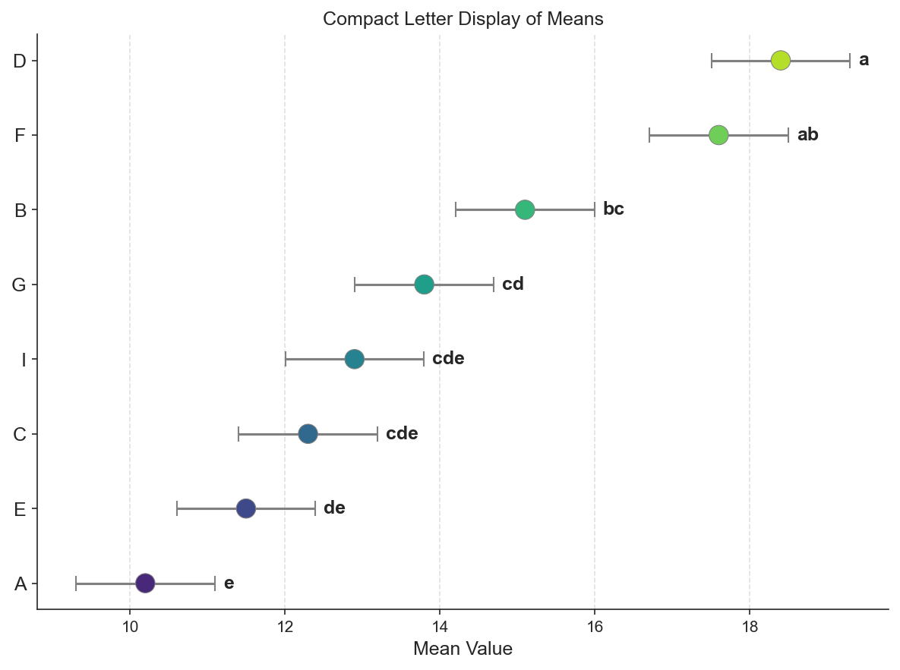
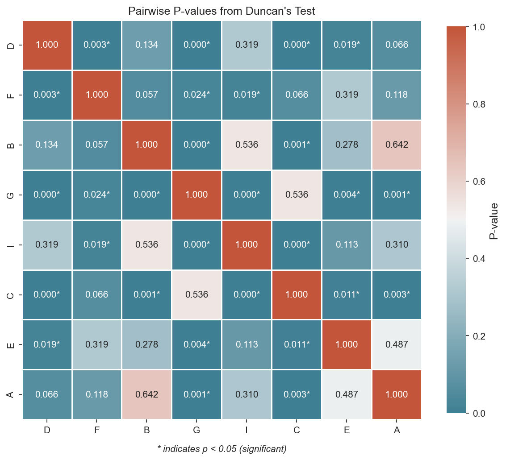

# Duncan's Multiple Range Test

A comprehensive Python implementation of Duncan's Multiple Range Test (DMRT) for multiple comparisons with advanced statistical analysis and visualization capabilities.

## 📦 Installation

To get started, install the package directly from the GitHub repository using pip:

```bash
pip install git+https://github.com/Ashutosh278/duncan-mrt.git
```

## ✨ Quick Start

The package is designed for simplicity. After installation, you can import and use the main functions directly from the top-level package.

```python
from duncans_test import duncan_test, plot_bar, plot_cld, plot_heatmap

# Run the test with raw data and an ANOVA table
# (assuming you have 'data', 'groups', and 'anova_df' pandas DataFrames)
results = duncan_test(data, groups, anova_table=anova_df)

# Visualize the results
plot_bar(results)
```

## 🚀 Key Features

  * ✅ **Flexible Input:** Supports both **raw data** (with automatic ANOVA computation) and **precomputed means** with known error terms.
  * ✅ **Advanced Handling:** Correctly handles **unequal replication** using the harmonic mean.
  * ✅ **Customizable Output:** Displays results in either **mean-sorted** (default) or **sequential** order.
  * ✅ **Rich Visualizations:** Generate publication-ready **bar plots**, **Compact Letter Displays (CLD)**, and **p-value heatmaps**.
  * ✅ **Clean Reports:** Provides well-formatted **HTML and text outputs** for easy integration into reports and publications.

## 📊 Usage Examples

### Example 1: Analysis with Precomputed Means

This is ideal for meta-analysis or when working with data where you have already calculated the group means, mean square error, and degrees of freedom.

```python
from duncans_test import duncan_test

# Using precomputed means and known error terms
means = [10.2, 15.1, 12.3, 18.4, 11.5, 17.6, 13.8, 12.9]
treatments = ['A', 'B', 'C', 'D', 'E', 'F', 'G', 'I']

n_rep = 3                      # Equal replication per treatment
ms_error = 2.4                 # Mean Square Error from a previous analysis
df_error = 16                  # Degrees of freedom from that analysis

results = duncan_test(data=means, groups=treatments,
                      n_rep=n_rep, ms_error=ms_error, 
                      df_error=df_error, alpha=0.05)

print(results)
```

**Output:**

```
======================================================================
              Duncan's Multiple Range Test Results              
======================================================================
Test Parameters:
 α = 0.050 | dfₑ = 16 | MSₑ = 2.400 | CV = 11.09%

Critical Ranges:
--------------------------
Step   Tprob     Duncan  
--------------------------
2      2.998     2.681   
3      3.144     2.812   
4      3.235     2.893   
5      3.297     2.949   
6      3.343     2.990   
7      3.376     3.020   
8      3.402     3.043   

Treatment Groups:
------------------------
Treatment  Mean    Group
------------------------
D          18.400  a   
F          17.600  ab  
B          15.100  bc  
G          13.800  cd  
I          12.900  cde 
C          12.300  cde 
E          11.500  de  
A          10.200  e   
========================
Treatments with the same letter are not significantly different
```

```python
from duncans_test import plot_bar, plot_cld, plot_heatmap

plot_bar(results)   # Bar chart with grouping letters
plot_cld(results)   # Horizontal dot plot
plot_heatmap(results)   # P-value heatmap
```


### 🖼️ Visualizations

The `duncans_test` package provides powerful plotting functions to visualize your results. Just pass the `DuncanResults` object to any of the plotting functions.



*Bar plot showing means with Duncan grouping letters*




*Compact Letter Display plot*




*P-value heatmap*


### Example 2: Analysis from Raw Data

This example demonstrates how to use the package with raw data and an ANOVA table, which provides the most accurate results.

```python
import numpy as np
import pandas as pd
from duncans_test import duncan_test
from statsmodels.formula.api import ols
from statsmodels.stats.anova import anova_lm

# Create sample raw data
np.random.seed(42)
data = np.concatenate([
    np.random.normal(10, 2, 5),    # Treatment A
    np.random.normal(15, 2, 5),    # Treatment B  
    np.random.normal(12, 2, 5),    # Treatment C
])
groups = ['A']*5 + ['B']*5 + ['C']*5

# Create a DataFrame and perform ANOVA
df = pd.DataFrame({'value': data, 'treatment': groups})
model = ols('value ~ C(treatment)', data=df).fit()
anova_table = anova_lm(model)

# Run Duncan's test with the raw data and ANOVA table
results = duncan_test(data=df['value'], groups=df['treatment'], anova_table=anova_table)
print(results)
```


## API Reference

### `duncan_test()`

The `duncan_test()` function is the core of the package, used to perform Duncan's Multiple Range Test. It's flexible, accepting either raw data or precomputed means.

```python
duncan_test(data, groups, *, anova_table=None, n_rep=None, 
            ms_error=None, df_error=None, alpha=0.05, sorting='mean')
```

-----

### **Parameters**

  * `data` (array-like): Can be either **raw data** or a list of **precomputed group means**.
  * `groups` (array-like): The corresponding **categorical treatment groups** for the data.
  * `anova_table` (pandas.DataFrame, optional): An ANOVA table. **Use this for raw data**.
  * `n_rep` (int or list of int, optional): The **number of replicates** for each treatment. **Use this with precomputed means**.
  * `ms_error` (float, optional): The **Mean Square Error** from a prior ANOVA. **Use with precomputed means**.
  * `df_error` (int, optional): The **Degrees of Freedom** for the error term. **Use with precomputed means**.
  * `alpha` (float, optional): The **significance level** (default: `0.05`).
  * `sorting` (str, optional): The display order of the output. Use `'mean'` (default) or `'sequential'`.

### **Returns**

  * A `DuncanResults` object containing the formatted grouping table, critical ranges, p-value matrix, and summary statistics.

## Dependencies

- pandas >= 1.3.0
- numpy >= 1.21.0
- scipy >= 1.7.0
- matplotlib >= 3.5.0
- seaborn >= 0.11.0

## Citation

Please cite this software for Duncan's test reference:

### This Package
```bibtex
@software{duncans_mrt_2025,
  title = {duncans-mrt: Python Implementation of Duncan's Multiple Range Test},
  author = {Ashutosh Sahu},
  year = {2025},
  url = {https://github.com/Ashutosh278/duncans-mrt},
}
```


## Inspiration and References

This implementation is inspired by the statistical methods and approach of the `agricolae` package in R:
```bibtex
@Manual{
  title  = {agricolae: Statistical Procedures for Agricultural Research},
  author = {Felipe de Mendiburu},
  year   = {2023},
  note   = {R package version 1.3-7},
  url    = {https://CRAN.R-project.org/package=agricolae},
}
```

## License

MIT License - see LICENSE file for details.

## Support


For questions and issues, please open an issue on [GitHub](https://github.com/Ashutosh278/duncans-mrt).


